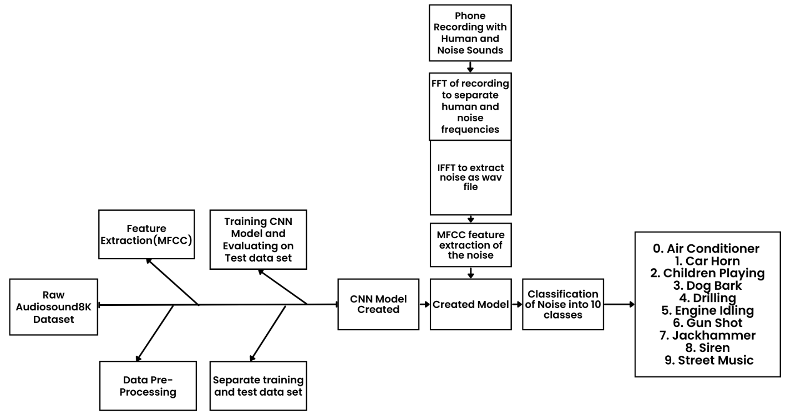
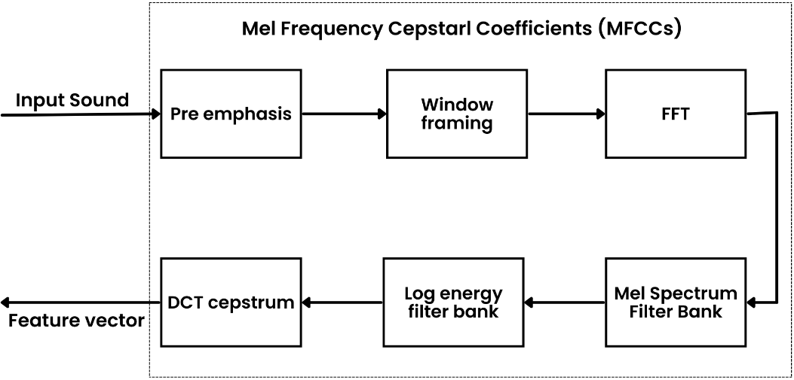
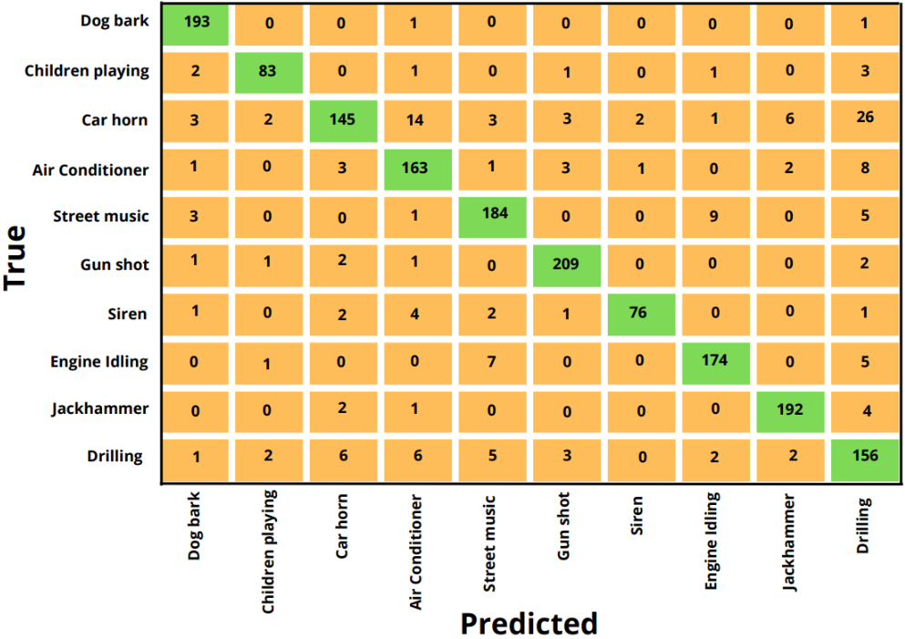

# Environmental Acoustic Noise Extraction and Classification using Deep Learning

This repository contains the code and resources for our work on **environmental acoustic noise extraction and classification** using **MFCC features** and a **Convolutional Neural Network (CNN)** trained on the UrbanSound8K dataset.

The project is implemented in a Jupyter notebook (`index.ipynb`).

---

## Overview

Urban environments contain many types of environmental noise (e.g., traffic, construction, sirens) that can negatively affect humans and wildlife.  
This project:

1. Extracts **Mel-Frequency Cepstral Coefficients (MFCCs)** from audio clips.
2. Trains a **1D CNN classifier** on the MFCC features of the **UrbanSound8K** dataset.
3. Uses the trained model to classify environmental noise into **10 predefined classes**:
   - Air Conditioner
   - Car Horn
   - Children Playing
   - Dog Bark
   - Drilling
   - Engine Idling
   - Gun Shot
   - Jackhammer
   - Siren
   - Street Music :contentReference[oaicite:1]{index=1}

The model achieves a **test accuracy of 90.44%** on environmental noise classification.

---

## Methodology

```markdown



```
